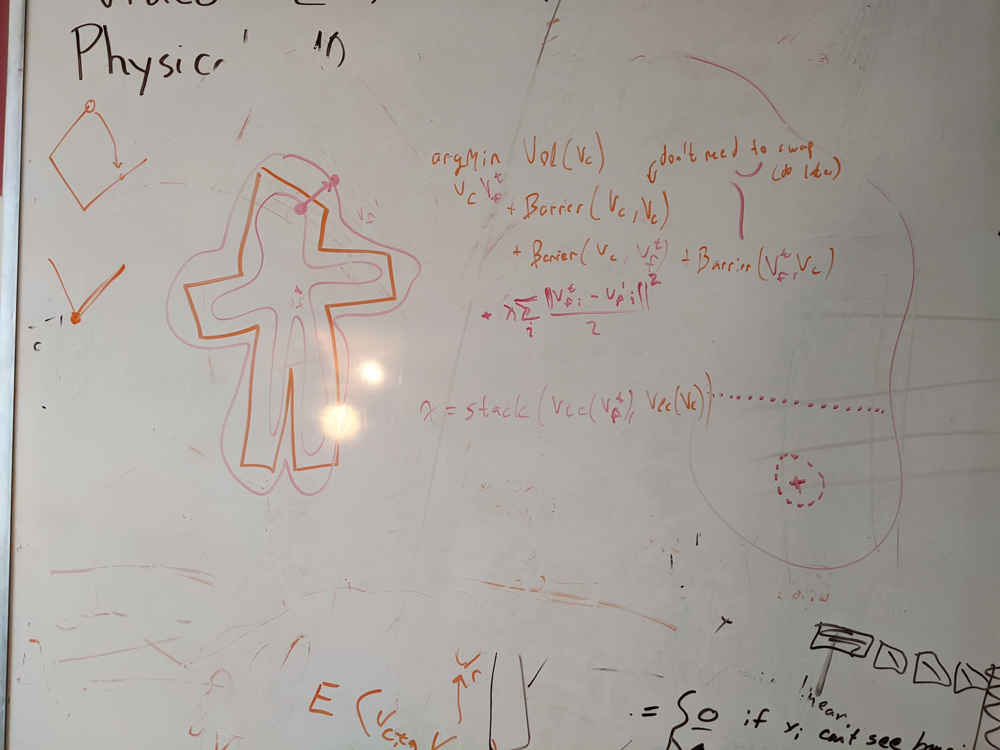

# Implementation notes

$$
\DeclareMathOperator{\Area}{Area}
\newcommand{\abs}[1]{\left\lvert #1 \right\lvert}
\newcommand{\brackets}[1]{\left[ #1 \right]}
\newcommand{\a}{\mathbf a}
\newcommand{\b}{\mathbf b}
\newcommand{\d}{\mathbf d}
\newcommand{\n}{\mathbf n}
\newcommand{\p}{\mathbf p}
\newcommand{\x}{\mathbf x}
\newcommand{\s}{\mathbf s}
\newcommand{\bv}{\mathbf v}
\newcommand{\F}{\mathbf F}
$$

## Calculating area of a polygon

For a shape $S$, Green's theorem tells us that

$$
\Area(S) = \iint_S 1 dA = \int_{\partial S} x dy
$$

Note that this is the line integral over the vector field $\F(x, y) = (0, x)$

If $S$ has a piecewise linear boundary and doesn't have any holes, then its boundary can be described by a sequence of points $(x_0, y_0), (x_1, y_1), ..., (x_{k-1}, y_{k-1}), (x_k, y_k) = (x_0, y_0)$ so that each piece of the boundary is

$$
\p_i(t) = \begin{pmatrix} x_i \\ y_i \end{pmatrix} + t \begin{pmatrix} x_{i+1} - x_i \\ y_{i+1} - y_i \end{pmatrix}
$$

Then

$$
\p_i'(t) = \begin{pmatrix} x_{i+1} - x_i \\ y_{i+1} - y_i \end{pmatrix}
$$

And taking the line integral,

$$
\begin{align*}
\Area(S) &= \int_{\partial S} x dy \\
&= \int_{\partial S} \begin{pmatrix} 0 \\ x \end{pmatrix} \cdot \begin{pmatrix} dx \\ dy \end{pmatrix} \\
&= \int_{\partial S} \F(\x) \cdot d\x \\
&= \sum_{i=0}^{k-1} \int_0^1 \F(\p(t)) \cdot \p'(t) dt \\
&= \sum_{i=0}^{k-1} \int_0^1 (x_i + t(x_{i+1} - x_i)) (y_{i+1} - y_i) dt \\
&= \sum_{i=0}^{k-1} (y_{i+1} - y_i) \brackets{x_i t + \frac{x_{i+1} - x_i}{2} t^2}_0^1 \\
&= \sum_{i=0}^{k-1} \frac{(y_{i+1} - y_i) (x_i + x_{i+1})}{2}
\end{align*}
$$

### Calculating area of polygon with holes

Suppose $S$ is topologically weird, then it is basically a union and difference of polygons. So we can use the above method to calculate the area of any loop in the boundary of $S$, and then use the winding number of a point on the loop to determine if we should add or subtract it from the total area.

## Calculating edge-edge distance

Closest points joining lines $\a_0 + s\d_0$ and $\a_1 + t\d_1$ are when the segment between them is perpendicular to both, i.e.
$$
\begin{align*}
(\a_0 + s \d_0 - \a_1 - t \d_1) \cdot \d_0 &= 0 \\
\begin{pmatrix} \d_0 & -\d_1 \end{pmatrix} \begin{pmatrix} s \\ t \end{pmatrix} \cdot \d_0 &= (\a_1 - \a_0) \cdot \d_0 \\
\text{and similarly} \\
\begin{pmatrix} \d_0 & -\d_1 \end{pmatrix} \begin{pmatrix} s \\ t \end{pmatrix} \cdot \d_1 &= (\a_1 - \a_0) \cdot \d_1
\end{align*}
$$

let $\d_0 = (a, b)$ and $\d_1 = (c, d)$, then we want to solve

$$
\begin{align*}
\begin{pmatrix} a & -c \\ b & -d \end{pmatrix} \begin{pmatrix} s \\ t \end{pmatrix} \cdot \begin{pmatrix} a \\ b \end{pmatrix} &= (\a_1 - \a_0) \cdot \d_0 \\
\begin{pmatrix} as - ct \\ bs - dt \end{pmatrix} \cdot \begin{pmatrix} a \\ b \end{pmatrix} &= (\a_1 - \a_0) \cdot \d_0 \\
a^2s - act + b^2s - bdt &= (\a_1 - \a_0) \cdot \d_0 \\
\text{and similarly} \\
acs - c^2t + bds - d^2t &= (\a_1 - \a_0) \cdot \d_1 \\
\text{so} \\
\begin{pmatrix} a^2 + b^2 & -(ac + bd) \\ ac + bd & -(c^2 + d^2) \end{pmatrix} \begin{pmatrix} s \\ t \end{pmatrix} &= \begin{pmatrix}(\a_1 - \a_0) \cdot \d_0 \\ (\a_1 - \a_0) \cdot \d_1 \end{pmatrix}
\end{align*}
$$

Can put this into linalg solve for $\mathbf A \x = \mathbf B$ by defining

$$
\mathbf A = \begin{pmatrix} a^2 + b^2 & -(ac + bd) \\ ac + bd & -(c^2 + d^2) \end{pmatrix},\ \mathbf B = \begin{pmatrix}(\a_1 - \a_0) \cdot \d_0 \\ (\a_1 - \a_0) \cdot \d_1 \end{pmatrix}
$$

## Calculating vertex-edge distance

The distance between a point $\x$ and a segment $E = \{\bv_0 + s (\bv_1 - \bv_0) : s \in [0, 1]\}$ is the distance from the point to the nearest point on $E$. We can calculate this nearest point by using the orthogonal decomposition of $\x - \bv_0$ with respect to the parallel and normal directions of $E$

Let $\d = \bv_1 - \bv_0$ and $\n = \text{rot}(90\degree) \d$, so if $\d = (a, b)$ then $\n = (b, -a)$

Let $\mathbf M = \begin{pmatrix} \d & \n \end{pmatrix} = \begin{pmatrix} a & b \\ b & -a\end{pmatrix}$, then if $(s, t) = \mathbf M^{-1} (\x - \bv_0)$, then $\x = \bv_0 + s\d + t\n$.

Note that $\bv_0 + s\d$ is along the line that $E$ is a segment of, and if $\hat s = \text{clamp}(s, 0, 1)$, then $\hat \x = \bv_0 + \hat s \d \in E$. We can't do anything about the $t\n$ term since it is perpendicular to $E$, so $\hat \x$ is the closest point to $\x$ on $E$, and the distance from $\x$ to $E$ is $\abs{\x - \hat \x}$.

## Coding plan



## Quirks of energies

### Area

- possible to invert the coarse mesh, in which case area is negative

  - this is really bad!

  - can deal with this by returning $\infty$ instead of negative values

  - ```
    def area_energy(V, E):
        Area = integrate area using green's theorem
        if (Area < 0)
            Area = Infinity
        return Area
    ```
