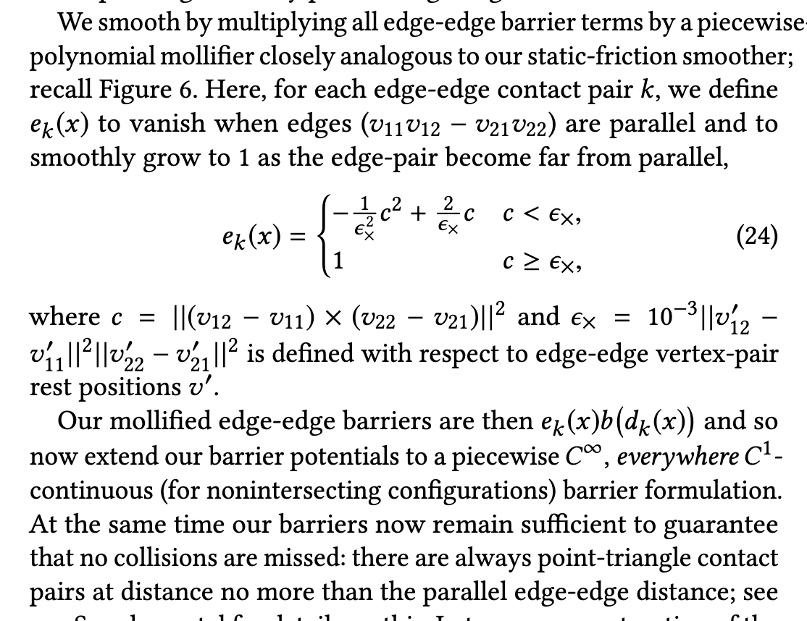

# Questions for Alec

## Gradient of SDF ✅

### Quadrature

- need quadrature to integrate SDF along edges so that we move vertices in a way that is good for edged around vertex rather than just vertex
  - helps us move the entire mesh the way we want rather than only paying attention to vertices
- edge midpoints is a good quadrature strategy to start
- can also look at higher order quadrature
  - where?

### Gradient when vertices of $F$ intersect $C$

- if $v \in V_F$ is on an edge of $C$, can use unit edge normal (pointing outward) as $\nabla SDF$ (since it tells us exactly which way edge is pointing)
  - need to figure out normal orientation for this :bangbang:
  - \^have not done that yet
- if $v$ is also a vertex of $C$, then can average normals of two adjacent edges of $C$

## Test meshes ✅

- currently creating from scratch
- can use Matlab gptoolbox `bwmesh` to turn alpha channel of img into mesh
  - https://github.com/alecjacobson/gptoolbox/blob/master/mesh/bwmesh.m

## How do we construct the constraint set?

- I'm thinking bounding volume hierarchy
- paper also mentions spatial hash
  - is there a spatial hash in libigl? i did not see it when looking through ``.h` files or tutorial

## Distance smoothing

- what is happening here? i do not see the intuition

## Friction ✅

- just want to verify - is it alright to skip friction for nested cages? does not seem necessary here
- yes, not necessary!

## TinyAD

- how do i set up the cmake properly? do you have an example project?

## Gradient descent ✅

- you suggested using gradient descent instead of Newton's method
- paper suggests using "barrier-aware projected Newton", are you saying replace this with gradient descent?
  - don't use newton's method, but still need line search
  - suggested looking at alg 9.2 in boyd to get an idea of backtracking line search

- is the idea to do gradient descent but using the filters for intersections and inversions that they suggest to use wihin the line search? (4.4)
  - don't need fancy filters, just need our energy to go to $\infty$ for intersections

## How will autodiff deal with branches?

- alec said it will be fine

## How do I treat the multiple meshes?

- this is something that I didn't totally follow within the paper
- everything in the paper is framed as if we are only simulating one mesh
  - can't just stack positions
    - in nested cages, we have different masses (infinite vs non infinite)
    - in general, IPC should work between different materials

## What kind of bounding volume would be best?

- AABB seems good for mesh intersections
- octree?
  - would need to move things so maybe not

## SPD projection

### Why do we need the Hessian to be SPD?

- $\mathbf M$ is SPD (symmetric positive definite) if $\mathbf M$ is symmetric and $\mathbf M \mathbf x \cdot \mathbf x \geq 0$
- is it for using newton's method, since we need to find the root of $\displaystyle \frac{\partial E}{\partial \mathbf x}$ so we need the hessian to be positive to use convex optimization methods like newton's?

### Is there any reading you suggest on how to project a matrix to be SPD

- looks like the reference ([Teran et al 2015](https://www.math.ucla.edu/~jteran/papers/TSIF05.pdf)) says just diagonalize and clamp eigenvalues to 0
